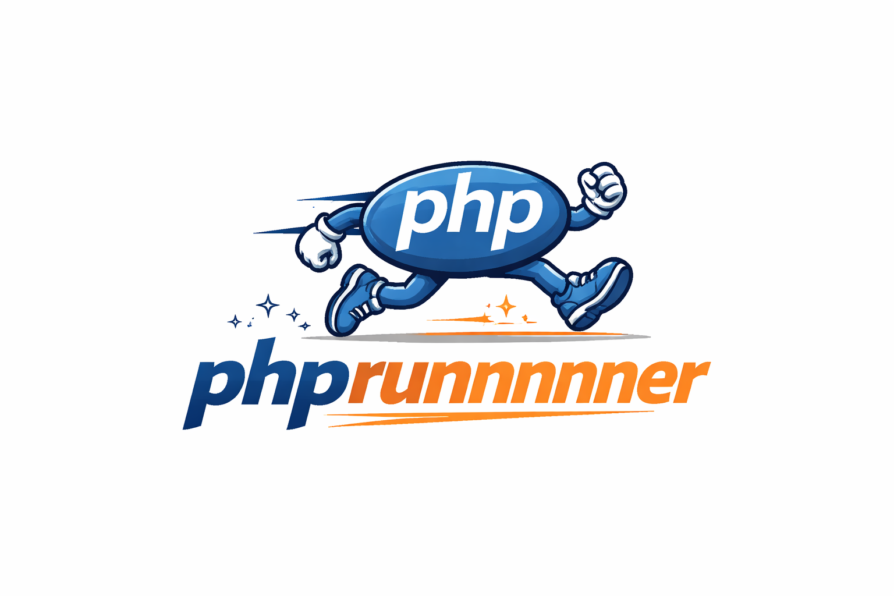
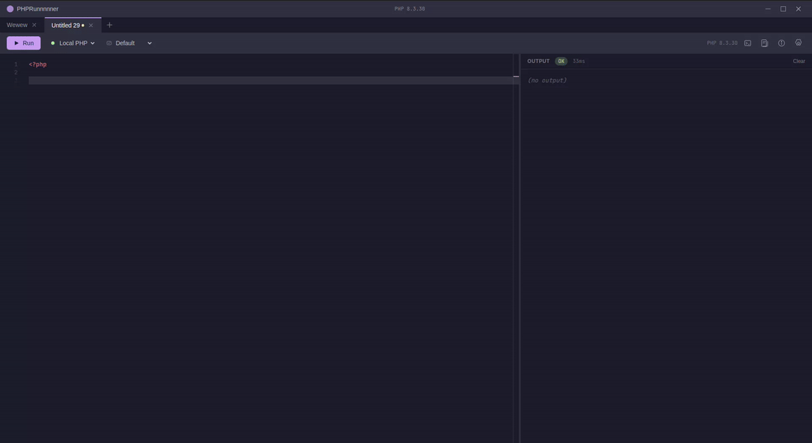
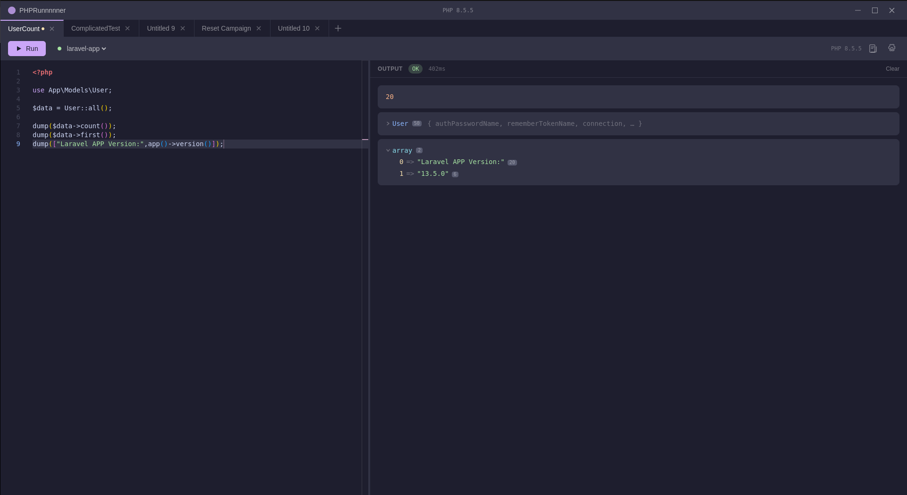
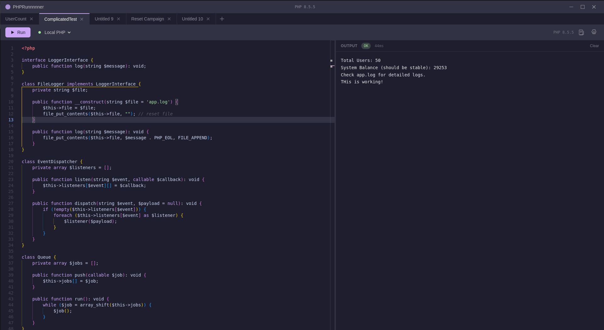
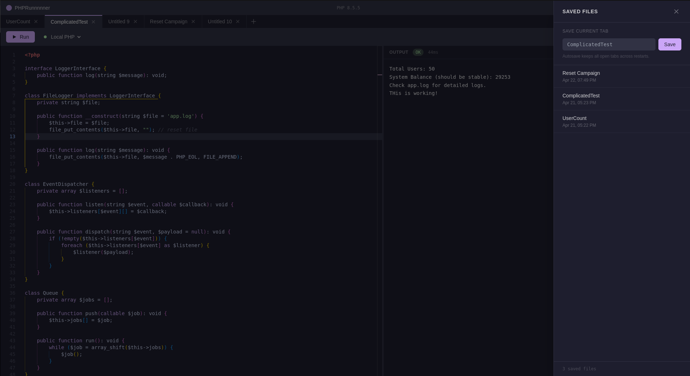
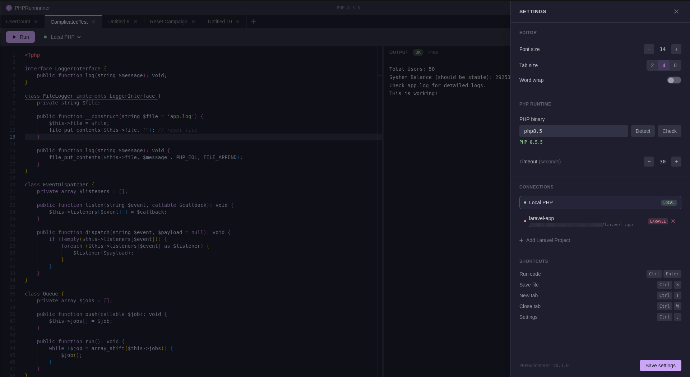

<p align="center">
  
</p>


<p align="center">
  
  
</p>

<p align="center">
  
</p>

<p align="center">
  
</p>

<p align="center">
  
</p>

<p align="center">
  
</p>

# PHPRunnnnner

A Tinkerwell-inspired PHP code runner built with Electron + Vue 3. Run and inspect PHP code interactively against your local PHP installation or a full Laravel application — with a pretty-printed output panel, multi-tab editing, and persistent settings.

---

## Features

- **Monaco Editor** — VS Code's editor with PHP syntax highlighting and a custom dark theme
- **Multi-tab editing** — open multiple scripts side by side
- **PHP execution** — runs against your local PHP binary via a secure temp file (no shell injection)
- **Pretty-print output** — `dump()` and `dd()` render typed, collapsible trees instead of raw text
  - Supports: null, bool, int, float, string, array, object, Laravel Collection, resource
  - Truncation guards: arrays/collections capped at 150 items, strings at 1000 chars, object props at 50
- **Laravel Tinker integration** — bootstrap any Laravel project and run code with full app context (Eloquent, facades, helpers)
- **Resizable split pane** — drag to resize the editor/output split; position is persisted
- **Settings panel** — font size, tab size, word wrap, PHP binary, execution timeout
- **Connection manager** — add multiple Laravel project connections, switch from the toolbar
- **Persistent settings** — all settings and connections saved to disk via `electron-store`

---

## Requirements

- **Node.js** 18+
- **PHP** 7.4+ installed and available in `PATH` (PHP 8.x recommended)
- For Laravel connections: a working Laravel project with `vendor/autoload.php` present

---

## Getting Started

```bash
# Install dependencies
npm install

# Start in development mode
npm run dev

# Build for production
npm run build

# Package as distributable (AppImage / deb / dmg / exe)
npm run package
```

> **Linux note:** the dev script passes `--no-sandbox` to Electron, which is required on most Linux environments without Chrome sandbox configured.

---

## Usage

### Running PHP

Write any PHP in the editor and press **Ctrl+Enter** or click the **Run** button.  
The `<?php` opening tag is optional — it is injected automatically.

```php
$items = range(1, 5);
dump($items);
echo "Sum: " . array_sum($items);
```

### Pretty-printing with `dump()` and `dd()`

These helpers are injected before your code runs. They output a typed, collapsible tree in the output panel.

```php
dump("hello", 42, true, null);
dump(['key' => 'value', 'nested' => [1, 2, 3]]);

$obj = new stdClass();
$obj->name = 'Alice';
$obj->roles = ['admin', 'editor'];
dump($obj);

dd(['stopped' => 'here']); // dump then exit
```

> `var_dump()` and `print_r()` still work — their output appears as plain text.

### Laravel Tinker

1. Open **Settings** (gear icon or `Ctrl+,`)
2. Scroll to **Connections** → click **Add Laravel Project**
3. Browse to your Laravel project root and click **Validate**
4. Click **Add**, then **Save settings**
5. Select the connection from the toolbar dropdown

Once selected, your code runs inside a fully bootstrapped Laravel application:

```php
// Eloquent
$users = User::where('active', true)->take(10)->get();
dump($users);

// Facades
dump(Cache::get('my-key'));
dump(DB::table('users')->count());

// Helpers
dump(app()->environment());
dump(config('app.name'));
```

> **Tip:** use `.take(N)` or `->limit(N)` before dumping large collections. The serializer caps output at 150 items and will show a truncation warning.

---

## Settings

Open with the gear icon in the toolbar or **Ctrl+,**.  
Click **Save settings** to persist changes to disk.

| Setting | Description |
|---|---|
| Font size | Editor font size (10–28px) |
| Tab size | Indentation width (2 / 4 / 8 spaces) |
| Word wrap | Wrap long lines in the editor |
| PHP binary | Path to the PHP executable (`php`, `/usr/bin/php8.2`, etc.) |
| Timeout | Maximum execution time in seconds (5–120) |

Settings are stored at:

| Platform | Path |
|---|---|
| Linux | `~/.config/PHPRunnnnner/config.json` |
| macOS | `~/Library/Application Support/PHPRunnnnner/config.json` |
| Windows | `%APPDATA%\PHPRunnnnner\config.json` |
| Flatpak | `~/.var/app/io.github.tomexsans.PHPRunnnnner/config/PHPRunnnnner/config.json` |

---

## Keyboard Shortcuts

| Action | Shortcut |
|---|---|
| Run code | `Ctrl+Enter` |
| Open settings | `Ctrl+,` |

---

## License

MIT
